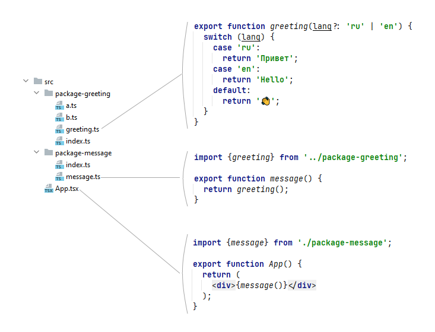
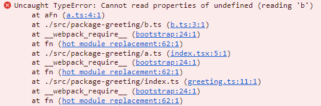
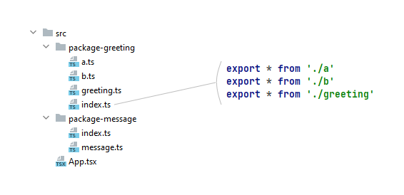

# Ошибка в циклической зависимости

## Введение

Давайте рассмотрим пример ошибки в циклической зависимости:

файл `a.ts`:

```typescript
import {b} from './b';

export function aFn(): number {
  return b + 1;
}
```

файл `b.ts`:

```typescript
import {aFn} from './a';

export const b = 1 + aFn();
```

**Пример 1.** Ошибка в циклической зависимости.

Вы можете подумать типо такого: "Ну, ясен пончик - это ошибка. Тут же видно, что есть зацикливание. Я такого не допущу".

Но хочу обратить ваше внимание на несколько моментов:

1. Сама по себе **циклическая зависимость – это не ошибка**. Вполне нормально, что файлы ссылаются друг на друга - программа от циклической зависимости не падает. Поэтому бороться с циклическими зависимостями может оказаться либо бессмысленным занятием, либо может так оказаться, что от циклических зависимостей полностью избавиться вообще невозможно.
2. **Ошибка** обычно возникает, когда в зацикленных файлах есть **экспортируемая(ые) константа**. И в одном из зацикленных файлов **используется константа, импортированная** из другого файла. Как раз это и иллюстрирует Пример 1. При runtime выполнении кода возникнет ошибка и далее программа перестанет работать (список ошибок падения представлен ниже).
3. **Индексные файлы**, в свою очередь, и вовсе способны перевести проблему в разряд нерешаемых, т.к. **по стектрейсу у вас может не получиться найти причину** - "конкретно какие файлы зациклены? и на каких константах?".

## Все усложняется, если есть индексные файлы

Давайте рассмотрим пример, реализованный в данном репозитории:



&nbsp;&nbsp;&nbsp;&nbsp;&nbsp;&nbsp;здесь:  
&nbsp;&nbsp;&nbsp;&nbsp;&nbsp;&nbsp;&nbsp;&nbsp;&nbsp;для React-компонента `<App>` надо импортировать функцию `message`  
&nbsp;&nbsp;&nbsp;&nbsp;&nbsp;&nbsp;&nbsp;&nbsp;&nbsp;для функцим `message` надо импортировать функцию `greeting`

&nbsp;&nbsp;&nbsp;&nbsp;&nbsp;&nbsp;И вроде бы все должно работать, но выполнение программы падает в ошибку:

&nbsp;&nbsp;&nbsp;&nbsp;&nbsp;&nbsp;

**Пример 2.** Программа не работает из-за ошибки в "чужой" циклической зависимости.

Импорт функции `greeting` идет через индексный файл, а при прочтении индексного файла javascript отрабатывает все указанные в нем экспорты:



**Пример 3.** Индексный файл способен стать генератором ошибок циклических зависимостей.

Ошибка же возникает на файлах `a.ts` и `b.ts`. Именно они зациклены друг на друга и у одного из них есть экспортированная константа, которая импортируется и используется в другом файле (см. Пример 1).  
Вы видите, что цепочка `<App>`-`message`-`greeting` не содержит циклических зависимостей, но при этом в runtime программа падает в ошибку:

- из-за ошибки в "чужой" циклической зависимости, т.к. в зацикленных файлах есть экпортированной и использованная константа;
- и, самое главное, из-за **индексного файла**. То есть, если в `message.ts` сделать импорт функции `greeting` напрямую, минуя индекс: `import {greeting} from '../package-greeting/greeting';` - то программа отработает без ошибки.

---
В примере 2 из стектрейса можно легко понять, где находится проблема.  
По мере развития проекта наличие индексных файлов может приводить к длинным цепочкам циклических зависимостей, например:

```
src\infra\map-layer\implementation\index.tsx 
  -> src\infra\map-layer\implementation\stub-layer\stub-layer.ts 
      -> src\infra\map-layer\implementation\stub-layer\stub-layer-render-controller.ts 
          -> src\app-common\util.ts 
              -> src\app-common\constant.ts 
                  -> src\controller\meteo-workplace\state\meteo-workplace.state.ts 
              -> src\controller\meteo-workplace\state\layer-list\layer-wrap-list.ts 
          -> src\controller\meteo-workplace\state\layer-list\layer-wrap.factory.ts 
      -> src\controller\meteo-workplace\state\layer-list\display-option-view.ts 
  -> src\infra\map-layer\index.tsx 
-> src\infra\map-layer\implementation\index.tsx
```

А когда программа падает из-за ошибки в циклической зависимости, ты смотришь в стектрейс и из него не понятно где?, что? и с чем? пересеклось.

# Как решать ошибки в циклической зависимости

## Правило

В файле, где **определена экспортируемая константа**, все импорты должны указывать на файл-источник. То есть нельзя импортировать с указанием на индексный файл.  
Таким образом, из списка проблем вы исключите практически неотлавливаемые ошибки в "чужих" циклических зависимостях.

Это правило не решает проблему ошибки в циклической зависимости. Оно упрощает ее поиск.

## Рекомендация

Все константы проекта перенести в один файл и экспортировать из него напрямую, без участия индекса.  
Преимущества такого подхода:

1. Проще реализовать правило
2. Сразу видно список всех констант, используемых на проекте

## Ошибка циклической зависимости

Если при соблюдении правила возникает ошибка циклической зависимости, то это означает, что для анализа у вас будут следующие входящие:

- файл с конкретной константой
- файл, где возникла ошибка

Ошибка будет связана с тем, что javascript пытается выполнить код с участием этой константы, а константа либо еще не определена, либо модуль с константой не проинициализирован.

# Как может выглядеть сообщение, когда возникает ошибка циклической зависимости

## ReferenceError: Cannot access 'ИмяКонстанты' before initialization

В нашем примере такая ошибка возникнет в файле `a.ts`, в случае если последовательность импортов будет следующей:  
импортируем `b.ts`, затем импортируем `a.ts`.

файл `a.ts`:

```typescript
import {b} from './b';

export function aFn(): number {
  return b + 1; // <------------ ReferenceError: Cannot access 'b' before initialization
}
```

## TypeError: Cannot read properties of undefined (reading 'ИмяКонстанты')

В нашем примере такая ошибка возникнет в файле `a.ts`, в случае если последовательность импортов будет следующей:  
импортируем `a.ts`, затем импортируем `b.ts`.  
(проверено в React-приложении, webpack, develop сборка)

файл `a.ts`:

```typescript
import {b} from './b';

export function aFn(): number {
  return b + 1; // <------------ TypeError: Cannot read properties of undefined (reading 'b')
}
```

---

# Еще размышления на тему циклических зависимостей

Пути решения проблемы циклических зависимостей:

1) **Пакет не должен импортировать из-вне**  
   Если это невозможно достичь, то удалить index

2) **Файл не должен импортировать некорректные пакеты** (пакеты, в которых есть импорт из вне)  
   Если это невозможно достичь, тогда импорт внутрь файла надо делать, указав прямую ссылку до файла в пакете

3) **Надо удалить все индексы**  
   Если и останутся зацикливания, то только прямые - между двумя файлами.

Как искать:

по фразе  
`export const`  
  


